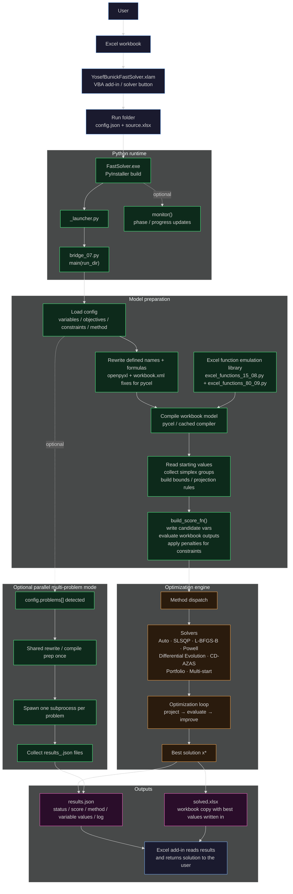

<p align="center">
  <a href="#build-instructions"></a>
  <a href="#workflow"></a>
  <a href="#how-it-works"></a>
  <a href="LICENCE.MD"></a>
</p>

# QuantSolver Engine

A custom optimization engine built in **Excel/VBA + Python** with Cython-compiled modules. Handles multi-objective, multi-variable, multi-constraint problems with parallel convergence. Built after the native Excel Solver fell short — tested and verified against a quant's reference benchmark, and beat it on accuracy.

Shipped as an `.xlam` Excel add-in so it drops into existing workflows with a single in-sheet button.

---

## How It Works

QuantSolver turns an Excel workbook into an optimization model, evaluates it through Python, and writes the best solution back to Excel.
```
To open:
Click Data->YosefBunick's QuantSolver->
input Objectives,Variables,and Constraints->Solve
(See Help Button for advanced features)
 ```


### At a high level:

1. The Excel add-in exports a temporary run folder containing `config.json` and `source.xlsx`.
2. `FastSolver.exe` starts the Python bridge through `_launcher.py`.
3. `bridge_07.py` loads the model specification, compiles the workbook formulas, and builds a scoring function.
4. The scoring function writes candidate variable values into the workbook model, evaluates objectives and constraints, and returns a penalized score.
5. The selected optimizer searches for the best variable vector.
6. Results are written to `results.json`, and solved values can be written back into `solved.xlsx`.

---

## Workflow



---

## Key Design Decisions

| Decision | Why |
|----------|-----|
| **Excel-native workflow** | Users keep their existing models and launch solves from inside Excel |
| **`.xlam` add-in packaging** | Drops into existing Excel workflows with a single in-sheet button |
| **Python bridge** | Heavy optimization logic runs outside VBA, while Excel remains the interface |
| **Cython-compiled modules** | Core Python modules can be compiled to native `.pyd` binaries for faster startup and distribution |
| **PyInstaller executable** | Ships as a standalone `FastSolver.exe` next to the `.xlam` and `_internal/` folder |
| **Formula-graph compilation** | Workbook formulas are evaluated through Python instead of repeatedly driving Excel manually |
| **Defined-name rewriting** | Excel Name Manager references are normalized before `pycel` compilation |
| **Multi-method optimizer portfolio** | Supports local, global, coordinate, and portfolio search strategies |
| **Constraint penalty scoring** | Objectives and constraints are converted into a single score function for optimizer compatibility |
| **Parallel multi-problem mode** | Independent models can run in separate subprocesses while sharing preparation work |

---

## Modules

| File | Role |
|------|------|
| `YosefBunickFastSolver.xlam` | Excel add-in UI and workbook-side integration |
| `_launcher.py` | PyInstaller entry point for `FastSolver.exe` |
| `bridge_07.py` | Main Python bridge, model loading, scoring, optimizer dispatch, results writing |
| `cached_formula_compiler_06.py` | Cached formula compilation support |
| `excel_functions_15_08.py` | Base Excel-compatible function implementations |
| `excel_functions_80_09.py` | Extended Excel-compatible function library with exact and smooth variants |
| `setup_cython.py` | Builds Cython/native extension modules |
| `patch_scipy_stats.py` | Patches SciPy pieces needed for PyInstaller compatibility |
| `11_build_exe.py` | Bundles the compiled solver into a standalone executable |

---

## Build Instructions

### Dependencies

```bash
Python 3.12
pip install pyinstaller==6.20.0 cython==3.2.4 setuptools==80.9.0 scipy==1.16.3 numpy==2.2.6 openpyxl==3.1.5 pycel==1.0b30
```

### Build

```bash
# 1. Set flag before building
#    In bridge_07.py, ensure: FS_RUN_FROM_SOURCE = False

# 2. Compile Python to native binaries
python setup_cython.py build_ext --inplace

# 3. Patch scipy for PyInstaller compatibility
python patch_scipy_stats.py

# 4. Bundle into standalone .exe
python 11_build_exe.py
```

---

## Install in Excel

1. Extract the built `.exe` — the `_internal/` folder and `.xlam` must be in the same directory.
2. Right-click the `.xlam`, check **Unblock** / **Trust**.
3. Open Excel → Options → Add-ins → Browse → select the `.xlam`.

---

## Version History

| Version | Performance |
|---------|-------------|
| 3 | Working baseline |
| 4 | First C++ compile pass — partial |
| 5 | 12 seconds |
| 6 | 8 seconds |
| 9 | Feature-complete UI |
| 12 | Best — ready to build |

---

## License

CC BY-NC-ND 4.0. See [`LICENCE.MD`](LICENCE.MD).
